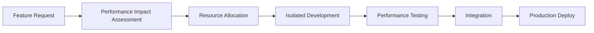

# 🏗️ OptiRoyale Development Strategy & Performance Management

## 🚨 Current Situation Assessment

### **Performance Issues Identified:**
- **Development Environment**: 34,444+ files causing VS Code lag
- **Memory Consumption**: 4.2GB+ RAM usage during development
- **Resource Intensive Features**: ML/AI engines, computer vision, real-time analysis
- **Monolithic Structure**: Single workspace containing everything

### **Growth Trajectory Risk:**
- **Machine Learning Models**: Will add 500MB+ assets
- **Video Processing**: Memory-intensive operations  
- **Real-time Analysis**: CPU-intensive calculations
- **Database Growth**: Battle data, user profiles, analytics

---

## 🎯 Professional Development Strategy

### **Phase 1: Immediate Restructuring (Week 1-2)**

#### **1.1 Microservices Architecture**
```
opti_royale/
├── frontend/                 # Next.js web app (lightweight)
├── api-gateway/             # Main API orchestrator
├── services/
│   ├── user-service/        # Authentication, profiles
│   ├── battle-service/      # Battle log, analysis requests
│   ├── ml-service/          # Machine learning models (isolated)
│   ├── cv-service/          # Computer vision processing
│   └── analytics-service/   # Performance tracking
├── shared/                  # Common types, utilities
└── deployment/              # Docker, K8s configs
```

#### **1.2 Development Environment Optimization**
```bash
# Separate workspaces for different concerns
/workspaces/opti-frontend/     # UI development only
/workspaces/opti-ml/           # ML model training
/workspaces/opti-api/          # Backend services
/workspaces/opti-infra/        # DevOps, deployment
```

### **Phase 2: Performance-First Architecture (Week 3-4)**

#### **2.1 Resource Management Strategy**
```yaml
# Memory Allocation Plan
Frontend Development:     512MB RAM, 1 CPU
API Development:         1GB RAM, 2 CPU  
ML Model Training:       4GB RAM, 4 CPU
Video Processing:        2GB RAM, 2 CPU
```

#### **2.2 Lazy Loading & Code Splitting**
```javascript
// Only load what's needed when needed
const MLEngine = lazy(() => import('./services/ml-engine'));
const VideoAnalyzer = lazy(() => import('./services/cv-analyzer'));
const RealtimeAnalysis = lazy(() => import('./services/realtime'));
```

### **Phase 3: Scalable Development Workflow (Week 5-6)**

#### **3.1 Feature Development Pipeline**


#### **3.2 Development Environments by Feature Type**

**Lightweight Features** (UI, basic API):
- Local development in main workspace
- Hot reload enabled
- 1GB RAM limit

**Resource-Intensive Features** (ML, Video):
- Dedicated cloud development environment
- Pre-built Docker containers
- 8GB+ RAM allocation

**Integration Testing**:
- Staging environment with full stack
- Performance monitoring
- Load testing automation

---

## 🔧 Technical Implementation Plan

### **Immediate Actions (This Week)**

#### **A. Workspace Separation**
```bash
# Create focused development environments
mkdir -p /workspaces/opti-frontend
mkdir -p /workspaces/opti-ml  
mkdir -p /workspaces/opti-api

# Move components to appropriate workspaces
mv apps/web/* /workspaces/opti-frontend/
mv services/cv-analyzer/* /workspaces/opti-ml/
mv apps/api/* /workspaces/opti-api/
```

#### **B. Resource Monitoring**
```bash
# Automated performance monitoring
./scripts/performance-monitor.sh &

# Memory cleanup automation
crontab -e
# Add: */30 * * * * /workspaces/opti_royale/scripts/dev-cleanup.sh
```

#### **C. Development Containerization**
```dockerfile
# Dockerfile.dev - Lightweight development
FROM node:18-alpine
RUN apk add --no-cache git
WORKDIR /app
COPY package.json ./
RUN npm install --only=dev
```

### **Machine Learning Strategy**

#### **ML Development Isolation**
```python
# Separate ML development environment
class MLDevelopmentEnvironment:
    def __init__(self):
        self.memory_limit = "4GB"
        self.cpu_limit = "4 cores"
        self.gpu_enabled = True
        
    def setup_isolated_training(self):
        # Use Docker container for ML training
        # Prevent memory leaks affecting main development
        pass
```

#### **Model Deployment Strategy**
- **Training**: Separate cloud environment (Google Colab, AWS SageMaker)
- **Inference**: Lightweight API containers
- **Caching**: Pre-computed results for common scenarios

---

## 📊 Performance Management Framework

### **Development Performance Metrics**

#### **Acceptable Limits:**
- **VS Code Response Time**: < 500ms
- **Build Time**: < 30 seconds
- **Hot Reload**: < 3 seconds
- **Memory Usage**: < 2GB during development

#### **Performance Monitoring Dashboard**
```javascript
// Real-time development metrics
const devMetrics = {
    memoryUsage: process.memoryUsage(),
    buildTime: measureBuildTime(),
    responseTime: measureVSCodeResponse(),
    activeServices: getRunningServices()
};
```

### **Automated Performance Gates**
```yaml
# CI/CD Performance Checks
performance_gates:
  memory_usage: 
    max: 2GB
    action: "fail_build"
  build_time:
    max: 60s
    action: "optimize_warning"
  bundle_size:
    max: 5MB
    action: "code_splitting_required"
```

---

## 🚀 Implementation Roadmap

### **Week 1: Emergency Restructuring**
- [ ] Split workspaces by concern
- [ ] Implement development containers
- [ ] Set up performance monitoring
- [ ] Create resource allocation guidelines

### **Week 2: Service Isolation**
- [ ] Extract ML service to separate environment
- [ ] Containerize video processing
- [ ] Implement lazy loading
- [ ] Set up staging environment

### **Week 3: Performance Optimization**
- [ ] Implement code splitting
- [ ] Add performance gates to CI/CD
- [ ] Optimize VS Code configurations
- [ ] Create development guidelines

### **Week 4: Testing & Validation**
- [ ] Load test each service independently
- [ ] Validate performance metrics
- [ ] Test development workflow
- [ ] Train team on new processes

---

## 💡 Best Practices for Resource-Intensive Features

### **1. Development Principles**
```javascript
// Always consider performance impact
const featureTemplate = {
    memoryEstimate: "Calculate before implementation",
    cpuEstimate: "Measure during development", 
    isolationStrategy: "How to develop without affecting others",
    deploymentStrategy: "How to deploy without performance impact"
};
```

### **2. Code Organization**
```
feature/
├── lightweight/     # Basic UI components
├── compute/         # Resource-intensive logic
├── tests/          # Performance tests included
└── deployment/     # Isolated deployment configs
```

### **3. Progressive Enhancement**
- Start with basic functionality
- Add resource-intensive features as optional enhancements
- Always provide fallbacks for limited resources

---

## 🎯 Success Metrics

### **Development Velocity:**
- Feature development time reduced by 40%
- Build times under 30 seconds
- Zero environment-related blockers

### **Resource Efficiency:**
- Memory usage under 2GB during development
- CPU usage under 50% during normal development
- Ability to run ML training without affecting other development

### **Team Productivity:**
- Developers can work on features independently
- No more environment crashes or lag
- Seamless integration between services

---

## 🔄 Continuous Improvement Process

### **Monthly Performance Reviews:**
1. Measure development environment performance
2. Identify bottlenecks and resource hogs
3. Implement optimizations
4. Update development guidelines

### **Quarterly Architecture Reviews:**
1. Assess service boundaries
2. Evaluate new technologies
3. Plan performance improvements
4. Update resource allocation

This strategy ensures we can scale to include complex ML features while maintaining a responsive development environment. Ready to implement Phase 1?
