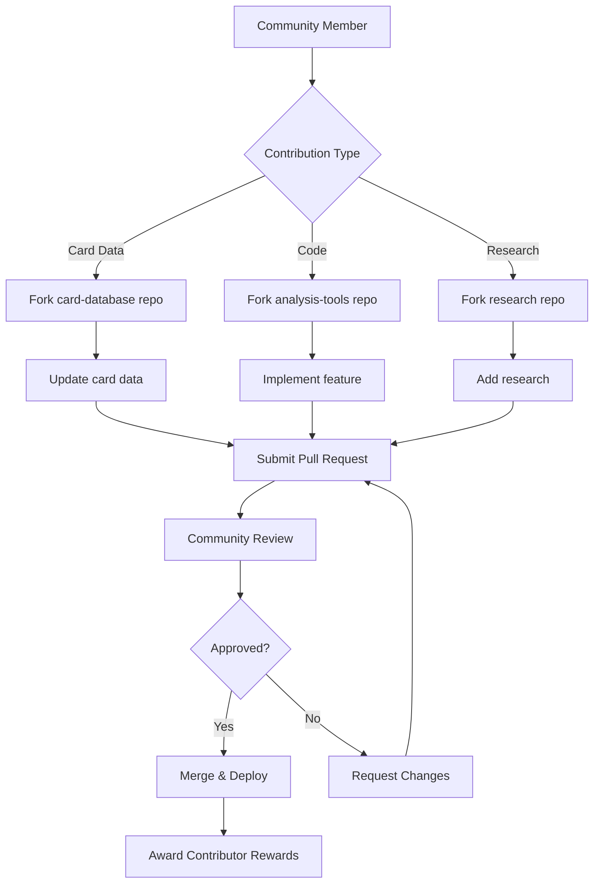
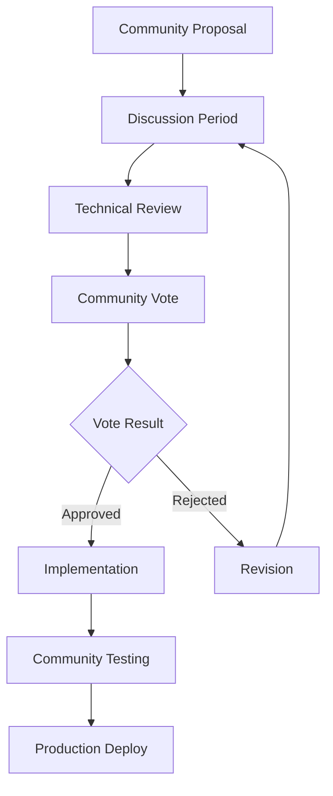

# 🌍 Open Source Strategy for OptiRoyale
*Building a Thriving Community-Driven Platform*

## 🎯 Open Source Philosophy

### Core Principles
- **Community-Driven Development**: Let the Clash Royale community shape the platform
- **Transparency**: Open card data, algorithms, and improvement metrics
- **Collaborative Innovation**: Enable developers to contribute advanced features
- **Educational Value**: Share AI/ML techniques for game analysis
- **Data Democracy**: Make placement analysis insights freely accessible

### Strategic Benefits
```typescript
const openSourceBenefits = {
  development: {
    fasterFeatureDelivery: "Community contributions accelerate development",
    bugFixes: "More eyes on code = faster bug detection and fixes",
    platformCoverage: "Community can add support for different devices/platforms",
    localization: "Community-driven translations for global reach"
  },
  
  data: {
    cardDatabase: "Community maintains comprehensive card statistics",
    metaAnalysis: "Distributed analysis from global player base",
    trainingData: "Community-contributed training data for AI models",
    validation: "Peer review of AI analysis accuracy"
  },
  
  growth: {
    communityOwnership: "Contributors become platform evangelists",
    developerEcosystem: "Third-party tools and integrations",
    educationalContent: "Community creates tutorials and guides",
    researchContributions: "Academic research partnerships"
  }
};
```

---

## 📦 Repository Structure Strategy

### Core Platform (Proprietary)
```
opti-royale-core/           # Private repository
├── apps/web/               # Next.js frontend
├── apps/api/               # Fastify backend  
├── apps/mobile/            # React Native app
├── services/ml-pipeline/   # Core AI models
└── infrastructure/         # Deployment configs
```

### Open Source Components
```
opti-royale-community/      # Public repository
├── card-database/          # Community-maintained card data
├── analysis-tools/         # Placement analysis utilities
├── ai-models/             # Open source AI models
├── data-connectors/       # API integrations
├── community-tools/       # Developer utilities
└── research/              # Academic research contributions
```

### Open Source Modules

#### 1. Card Database Management
```python
# card-database/
opti-royale-cards/
├── data/
│   ├── cards.json          # Complete card database
│   ├── balance-history.json # Historical balance changes
│   └── meta-snapshots/     # Weekly meta reports
├── scripts/
│   ├── data-updater.py     # Automated card data updates
│   ├── balance-detector.py # Balance change detection
│   └── meta-analyzer.py    # Meta analysis tools
├── validators/
│   ├── schema-validator.py # Data validation
│   └── integrity-checker.py # Data integrity checks
└── api/
    ├── card-service.py     # Card data API
    └── webhooks.py         # Update notifications
```

#### 2. Analysis Tools & Algorithms
```python
# analysis-tools/
opti-royale-analysis/
├── placement-analyzer/
│   ├── board-detector.py   # Game board detection
│   ├── card-classifier.py  # Card identification
│   └── placement-optimizer.py # Optimal placement calculation
├── computer-vision/
│   ├── image-processing.py # CV utilities
│   ├── model-training.py   # Training scripts
│   └── inference.py        # Real-time inference
├── strategy-engine/
│   ├── deck-analyzer.py    # Deck synergy analysis
│   ├── counter-detector.py # Counter identification
│   └── meta-predictor.py   # Meta trend prediction
└── benchmarks/
    ├── accuracy-tests.py   # Model accuracy testing
    └── performance-tests.py # Performance benchmarking
```

#### 3. Community Data Connectors
```typescript
// data-connectors/
opti-royale-connectors/
├── clash-royale-api/       # Official API wrapper
├── royaleapi/              # RoyaleAPI integration
├── deckshop/               # DeckShop Pro integration
├── statsroyale/            # StatsRoyale integration
├── replay-parser/          # Replay file parser
└── stream-capture/         # Live stream analysis
```

---

## 🤝 Community Contribution Framework

### Contribution Types & Rewards

#### Card Data Contributions
```yaml
card_data_contributions:
  new_card_additions:
    description: "Add new cards when Supercell releases them"
    requirements: ["accurate stats", "proper formatting", "image assets"]
    rewards: ["contributor badge", "early access features", "recognition"]
    
  balance_updates:
    description: "Update card statistics after balance changes"
    requirements: ["verified data sources", "change documentation"]
    rewards: ["balance tracker badge", "premium features", "leaderboard"]
    
  meta_analysis:
    description: "Weekly meta reports and tier lists"
    requirements: ["data analysis", "trend identification", "community validation"]
    rewards: ["meta analyst badge", "content creator perks", "revenue share"]
```

#### Code Contributions
```yaml
code_contributions:
  bug_fixes:
    description: "Fix bugs in open source components"
    requirements: ["test coverage", "documentation", "code review"]
    rewards: ["contributor status", "bug hunter badge", "hall of fame"]
    
  feature_development:
    description: "Develop new analysis features"
    requirements: ["design approval", "implementation", "testing"]
    rewards: ["feature author credit", "premium access", "profit sharing"]
    
  ai_model_improvements:
    description: "Improve AI model accuracy or performance"
    requirements: ["benchmark results", "research documentation", "peer review"]
    rewards: ["AI researcher badge", "academic credit", "consulting opportunities"]
```

#### Research Contributions
```yaml
research_contributions:
  academic_papers:
    description: "Publish research using OptiRoyale data"
    requirements: ["peer review", "open access", "data citation"]
    rewards: ["research partnership", "dataset access", "co-authorship"]
    
  training_datasets:
    description: "Contribute labeled training data"
    requirements: ["quality validation", "proper licensing", "documentation"]
    rewards: ["data contributor badge", "model training credits", "recognition"]
```

### Contribution Workflow


---

## 🔄 Automated Update System

### Card Data Pipeline
```python
class CommunityUpdatePipeline:
    def __init__(self):
        self.sources = {
            "official_api": ClashRoyaleAPI(),
            "community_apis": [RoyaleAPI(), DeckShopPro(), StatsRoyale()],
            "community_contributors": GitHubContributors(),
            "balance_trackers": BalanceChangeDetectors()
        }
        
    async def detect_updates(self):
        """Detect when card updates are needed"""
        update_signals = []
        
        # Check for new Supercell releases
        if await self.check_game_version_update():
            update_signals.append("game_version_update")
            
        # Check for balance changes
        if await self.detect_balance_changes():
            update_signals.append("balance_changes")
            
        # Check for new cards
        if await self.detect_new_cards():
            update_signals.append("new_cards")
            
        return update_signals
    
    async def trigger_community_update(self, signal_type):
        """Trigger community update process"""
        if signal_type == "balance_changes":
            # Create GitHub issues for each card that needs updating
            await self.create_balance_update_issues()
            # Notify community contributors
            await self.notify_contributors("balance_update")
            
        elif signal_type == "new_cards":
            # Create template issues for new card data
            await self.create_new_card_issues()
            # Reward first contributor who adds complete data
            await self.setup_new_card_bounty()
    
    async def validate_community_contributions(self, pull_request):
        """Automated validation of community contributions"""
        validations = {
            "schema_validation": await self.validate_data_schema(pull_request),
            "accuracy_check": await self.cross_reference_sources(pull_request),
            "completeness": await self.check_data_completeness(pull_request),
            "formatting": await self.validate_formatting(pull_request)
        }
        
        if all(validations.values()):
            await self.auto_approve_pr(pull_request)
        else:
            await self.request_changes(pull_request, validations)
```

### Balance Change Detection
```python
class BalanceChangeDetector:
    def __init__(self):
        self.watchers = [
            SupercellNewsWatcher(),
            RedditPostWatcher(),
            YouTubeContentWatcher(),
            DiscordAnnouncementWatcher()
        ]
    
    async def monitor_balance_changes(self):
        """Continuously monitor for balance change announcements"""
        for watcher in self.watchers:
            announcements = await watcher.check_for_announcements()
            
            for announcement in announcements:
                if self.is_balance_change(announcement):
                    await self.trigger_community_update(announcement)
    
    async def trigger_community_update(self, announcement):
        """Create GitHub issues for community to update card data"""
        affected_cards = self.extract_affected_cards(announcement)
        
        for card in affected_cards:
            issue = await self.create_github_issue(
                title=f"Balance Update: {card.name}",
                body=f"""
                ## Balance Change Detected
                
                **Card**: {card.name}
                **Announced**: {announcement.date}
                **Source**: {announcement.source}
                
                ## Changes Needed
                {self.format_required_changes(card, announcement)}
                
                ## Bounty
                - First accurate update: 🏆 100 contributor points
                - Complete with testing: 🎯 50 additional points
                
                ## Resources
                - [Official Announcement]({announcement.url})
                - [Current Card Data](link_to_current_data)
                - [Update Template](link_to_template)
                """,
                labels=["balance-update", "bounty", f"card:{card.id}"]
            )
            
            # Notify community contributors
            await self.notify_contributors(card, issue)
```

---

## 🏆 Community Incentive System

### Contributor Ranking System
```typescript
interface ContributorProfile {
  githubUsername: string;
  totalContributions: number;
  contributionTypes: {
    cardData: number;
    codeChanges: number;
    research: number;
    documentation: number;
  };
  badges: Badge[];
  level: ContributorLevel;
  rewards: Reward[];
}

enum ContributorLevel {
  NEWCOMER = "newcomer",           // 0-10 contributions
  CONTRIBUTOR = "contributor",     // 11-50 contributions  
  EXPERT = "expert",              // 51-200 contributions
  MAINTAINER = "maintainer",      // 201+ contributions
  CORE_TEAM = "core_team"         // Invited core team
}

const badges = {
  "first_contribution": "🎯 First Contribution",
  "balance_tracker": "⚖️ Balance Tracker",
  "bug_hunter": "🐛 Bug Hunter", 
  "feature_creator": "✨ Feature Creator",
  "data_validator": "📊 Data Validator",
  "ai_researcher": "🤖 AI Researcher",
  "meta_analyst": "📈 Meta Analyst",
  "community_champion": "👑 Community Champion"
};
```

### Rewards & Recognition
```yaml
reward_system:
  immediate_rewards:
    - contributor_points: "Earn points for each contribution"
    - badges: "Unlock achievement badges"
    - leaderboards: "Appear on contributor leaderboards"
    - premium_access: "Free premium features"
    
  milestone_rewards:
    level_10_contributions:
      - custom_profile_badge
      - early_access_features
      - contributor_discord_role
      
    level_50_contributions:
      - profit_sharing_eligibility
      - feature_naming_rights
      - direct_developer_access
      
    level_200_contributions:
      - maintainer_status
      - decision_making_power
      - revenue_share_percentage
      
  special_recognition:
    monthly_mvp:
      description: "Most valuable contributor each month"
      rewards: ["cash_prize", "featured_profile", "swag_package"]
      
    research_partnership:
      description: "Academic research collaborations"
      rewards: ["co_authorship", "conference_sponsorship", "dataset_access"]
      
    hiring_opportunities:
      description: "Job opportunities at OptiRoyale"
      rewards: ["interview_fast_track", "internship_offers", "full_time_positions"]
```

---

## 📊 Community Governance

### Decision Making Process


### Governance Structure
```typescript
interface CommunityGovernance {
  coreTeam: {
    role: "Final decision authority on major changes";
    members: string[];
    responsibilities: [
      "roadmap_planning",
      "conflict_resolution", 
      "quality_standards",
      "community_management"
    ];
  };
  
  maintainers: {
    role: "Module-specific maintenance and development";
    selection: "Promoted from expert contributors";
    permissions: [
      "merge_pull_requests",
      "create_releases",
      "manage_issues",
      "mentor_contributors"
    ];
  };
  
  contributors: {
    role: "Community development and data maintenance";
    anyone_can_join: true;
    voting_power: "proportional_to_contributions";
  };
}
```

### Community Guidelines
```markdown
# OptiRoyale Community Guidelines

## Code of Conduct
- Respectful and inclusive behavior
- Constructive feedback and criticism
- Collaboration over competition
- No spam, self-promotion, or off-topic content

## Contribution Standards
- Follow established coding standards
- Include comprehensive tests
- Write clear documentation
- Respect intellectual property

## Data Quality Requirements
- Verify accuracy from multiple sources
- Document data sources and methodology
- Validate against existing benchmarks
- Maintain backward compatibility

## Review Process
- All contributions require peer review
- Maintainers must approve major changes
- Community can vote on controversial decisions
- Technical standards are non-negotiable
```

---

## 🚀 Implementation Roadmap

### Phase 1: Foundation (Month 1-2)
```bash
# Open Source Setup
□ Create public GitHub organization
□ Set up contributor documentation
□ Establish code of conduct
□ Create initial open source modules
□ Set up automated testing and CI/CD
□ Launch community Discord/forum
```

### Phase 2: Community Building (Month 3-4)
```bash
# Community Engagement
□ Recruit initial contributors
□ Launch card data update system
□ Create contributor reward system  
□ Establish governance structure
□ Host first community events
□ Partner with Clash Royale content creators
```

### Phase 3: Ecosystem Growth (Month 5-6)
```bash
# Ecosystem Development
□ Launch third-party developer program
□ Create API for community tools
□ Establish research partnerships
□ Build contributor marketplace
□ Launch educational content program
□ Scale automated update systems
```

---

## 📈 Success Metrics

### Community Health Metrics
```typescript
interface CommunityMetrics {
  contributors: {
    total_active_contributors: number;
    monthly_new_contributors: number;
    contributor_retention_rate: number;
    average_contributions_per_user: number;
  };
  
  contributions: {
    monthly_pull_requests: number;
    average_time_to_merge: number;
    code_quality_score: number;
    community_satisfaction_rating: number;
  };
  
  data_quality: {
    card_data_accuracy: number;     // Target: 99%+
    update_lag_time: number;        // Target: <24 hours
    community_validation_rate: number;
    data_completeness_score: number;
  };
  
  ecosystem: {
    third_party_integrations: number;
    api_usage_growth: number;
    research_papers_published: number;
    educational_content_created: number;
  };
}
```

### Quarterly Goals
```
Q1 2025: Foundation
- 20+ active contributors
- Complete card database
- Automated update system
- Community governance structure

Q2 2025: Growth  
- 100+ active contributors
- 5+ third-party integrations
- Research partnerships
- Educational content program

Q3 2025: Scale
- 500+ active contributors  
- Developer ecosystem
- Academic publications
- International expansion

Q4 2025: Sustainability
- Self-sustaining community
- Revenue-sharing program
- Multiple language support
- Industry recognition
```

This open source strategy transforms OptiRoyale from a single-company project into a community-driven platform that leverages the collective intelligence and passion of the Clash Royale community. The key is balancing open collaboration with sustainable business practices.

**Next Steps**: Start with Phase 1 foundation work while building initial core platform features in parallel.
